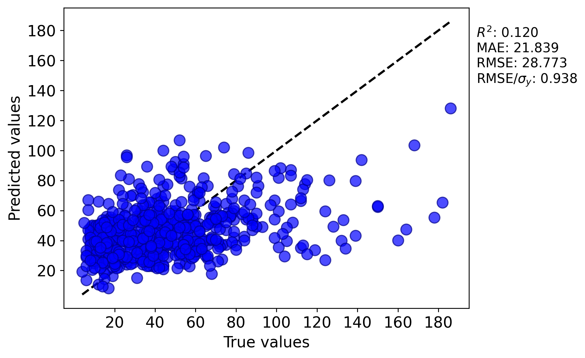
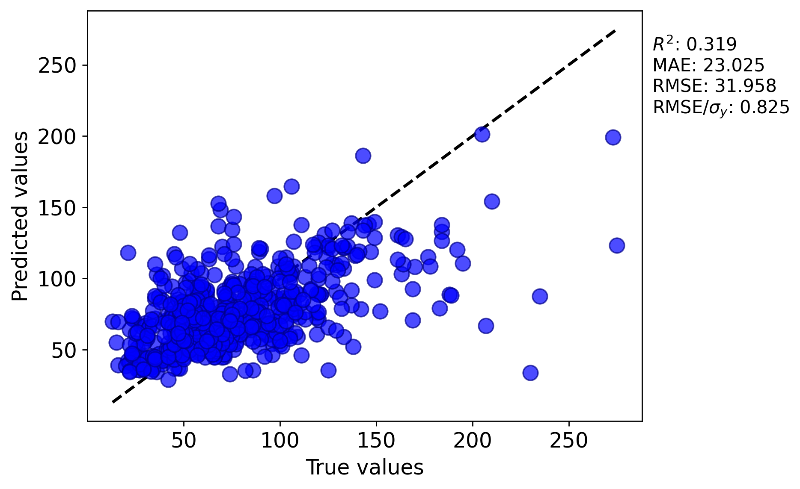

# RiverFood-ML-Regression

## Note on Version Labels: The Jupyter notebooks inside this repository contain internal version labels (e.g., "V1", "V2") that were incorrectly assigned during their creation. The final, correct version naming and chronology is represented by the GitHub filenames and the analysis described in this README. This was an administrative error in the notebook metadata and does not affect the validity of the code or results presented.

## Overview

This project represents an undergraduate research initiative at the University of Wisconsin-Madison undertaken in partnership with **The River Food Pantry**. Our primary goal was to leverage machine learning to enhance fundraising strategies for an organization critical to its community, serving over 2,500 clients weekly.

While our journey to build a highly accurate predictive model encountered the common real-world challenge of noisy, complex human behavior data, the process itself was a resounding success. Through rigorous analysis, we identified the key drivers of donations, leading to actionable strategic insights that directly inform how The River Food Pantry can optimize its fundraising efforts.

## Project Goals

**Initial Goal:** Develop a robust regression model to predict individual donation amounts.

**Focused Goal:** Through iterative modeling, we pivoted to a focus on **diagnostic analysis** and **feature importance**. This shift unlocked the most valuable outcome: clear, data-driven guidance for strategic decision-making, proving that not all ML success is measured by prediction accuracy alone.

### Data
The dataset consisted of **over 9,800 individual donation records**, encompassing 51+ features related to donation campaigns, donor history, and transaction details.

### Tools & Libraries
*   **Language:** Python
*   **Libraries:** `pandas`, `NumPy`, `scikit-learn`, `XGBoost`, `Matplotlib`, `Seaborn`, `xgboost`, `SNAP`
*   **Methods:** Random Forest Regression, XGBoost Regression, K-Fold Cross-Validation, Hyperparameter Tuning, SelectKBest Feature Selection.

### Results

Our development process was iterative, involving two primary model versions that taught us valuable lessons about our data and the problem space.

**Version 3 (The Overfit Model):**
Our initial model showed classic signs of overfitting. It performed exceptionally well on the training data but failed to generalize to unseen data, indicating it had memorized noise rather than learning foundational patterns.
*   **Training Set:** R² = 0.873, RMSE = 10.931
*   **Test Set:** R² = 0.120, RMSE = 28.773

**Version 4 (The Generalizable Model):**
In response, we refined our approach through aggressive feature selection and hyperparameter tuning aimed at reducing complexity. This resulted in a more honest and stable model. While predictive accuracy on new data remained a challenge, the model's consistent behavior gave us high confidence in the insights it generated.
*   **Training Set:** R² = 0.868, RMSE = 14.091
*   **Test Set:** R² = 0.319, RMSE = 31.958

**Visualizing the Journey:**

  
  
   
  <em>Figure 1: Parity plots demonstrating the evolution from an overfit model (V3, left) to a more generalized and reliable model (V4, right).</em>

**Key Takeaway:** This evolution from V3 to V4 is a classic experience in applied ML. It reinforced a critical lesson: a simpler, more understandable model that provides reliable insights is often more valuable than a complex, black-box model that cannot be trusted.

The true success of this project lies in the powerful, actionable insights uncovered through our analysis. The feature importance analysis from our stable V4 model revealed:

*   **Campaign Concentration:** **76.98% of all donations originated from the top-performing campaigns.** This finding strongly advocates for a strategy of identifying high-yield initiatives and reallocating resources to maximize their impact.
*   **Recurring Donation Impact:** Recurring donations were identified as a paramount driver of revenue, linked to a **27.76% estimated increase in total funding.** This provides a concrete, data-backed argument for expanding marketing efforts aimed at converting one-time donors into sustainers.
*   **Dimensionality Reduction:** We successfully reduced the model's input from 51 to a core set of 10 key variables, simplifying the problem space and clearly identifying the most impactful levers for fundraising.

**Repository Purpose & Disclaimer**

This repository is a static portfolio piece intended solely to document and showcase my personal contributions, analytical process, and the final results of the research project.

It is not intended for collaboration, reproduction, or public use. The code and notebooks are provided for viewing purposes only to demonstrate my technical skills and project involvement.

Please note:
- The raw data is not included due to privacy and confidentiality agreements with The River Food Pantry.
- The environment and dependencies are not configured for public use.
- This project is not open-source and is presented here as a sample of my work.

## License
This project is intended for academic and research purposes. Data is proprietary to The River Food Pantry.
